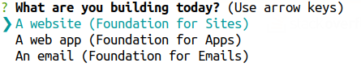
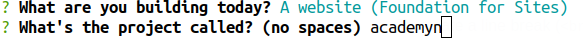
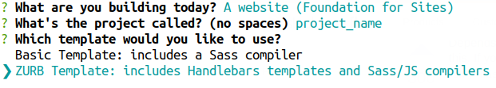
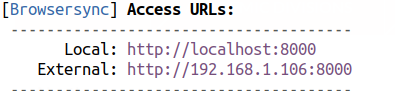

# Multipurpose Theme

This is a theme based on the Front-end Framework <strong>Zurb Foundation</strong>

## Steps to recreate this project locally


1. Install Foundation CLI
  ```console
  $ npm install --global foundation-cli
  # or sudo npm install --global foundation-cli
  ```
2. Create a new project
  ```console
  $ foundation new
  ```
3. Choose the first option i.e. A website (Foundation for Sites)

    

4. Give the name of your project

    
5. Choose the template type as ZURB Template

    

6. Once the project is created, replace the src folder with the src folder downloaded from this repository [Academyn](https://github.com/karan-singare/academyn.git)

7. To see the project on the browser enter the following command

  ```console
  $ foundation watch
  # sudo foundation watch
  ```
8. Go to your project folder and  Copy the fontawesome from src to dist i.e.
  ```console
  $ cp src/assets/js/fontawesome-all.js dist/assets/js/
  ```
9. Now open the browser and go to Local link provided by terminal

    
10. All set You can see the project locally
